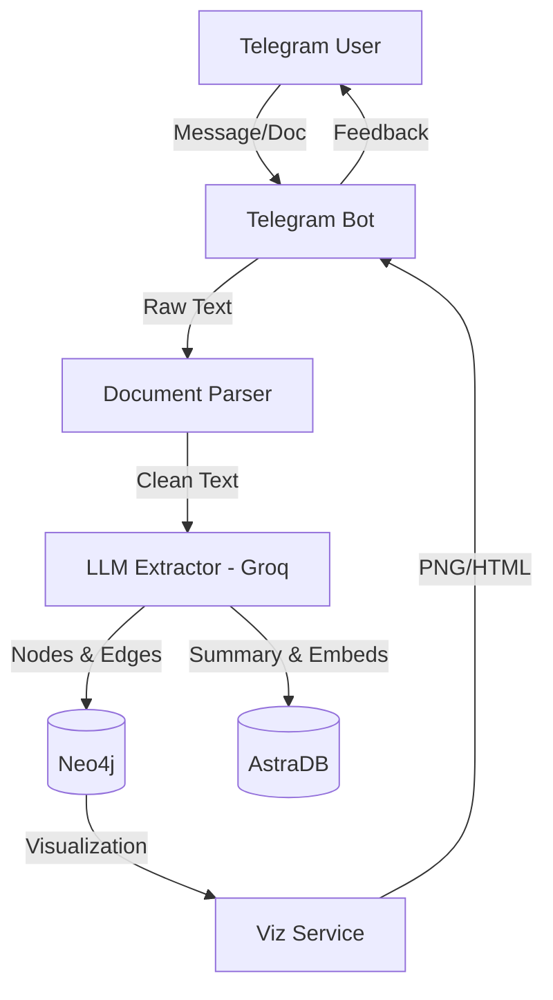

# 🧠 Knowledge Graph Builder Bot

Transform your research notes, PDFs, and documents into an intelligent, explorable **Knowledge Graph**. This AI-powered Telegram bot acts as your "external brain," helping you visualize connections, detect research gaps, and perform semantic search across your entire knowledge base.

---

## ✨ Key Features

- **📄 Multi-Format Analysis**: Send PDFs, Word docs, research papers, or just plain text.
- **📸 OCR Support**: Snap a photo of a textbook or paper, and the bot will extract the knowledge.
- **🕸️ Knowledge Graph Extraction**: Automatically identifies concepts (Theories, Methods, Algorithms, Authors) and their relationships using **Groq LLM (Llama 3 70B)**.
- **📊 Interactive Visualizations**: Generates beautiful, zoomable graph visualizations (via PyVis and NetworkX).
- **🔬 Research Gap Detection**: AI-driven analysis to identify missing links or unexplored territories in your research.
- **🛣️ Concept Pathfinding**: Need to see how "Quantum Computing" connects to "Graph Theory"? Use `/path` to find the reasoning chain.
- **🔍 Semantic Memory**: Powered by **AstraDB**, search through your documents by *meaning*, not just keywords.
- **💨 Lightweight & Fast**: Designed to run efficiently on **Render** using zero-local-RAM embedding models (Jina AI API).

---

## 🛠️ Tech Stack

- **Framework**: `python-telegram-bot` (Async)
- **Intelligence**: **Groq Cloud** (Llama-3.3-70B-Versatile)
- **Graph Database**: **Neo4j** (AuraDB or Local)
- **Vector Database**: **DataStax AstraDB**
- **Embeddings**: **Jina AI** (`jina-embeddings-v3`)
- **Visuals**: `pyvis`, `networkx`, `matplotlib`

---

## 🚀 Getting Started

### 1. Prerequisites
You will need API keys for the following services:
- [Telegram Bot Token](https://t.me/BotFather)
- [Groq AI](https://console.groq.com/)
- [Neo4j AuraDB](https://neo4j.com/cloud/aura/) (Free tier works great!)
- [AstraDB](https://astra.datastax.com/)
- [Jina AI](https://jina.ai/embeddings/)

### 2. Installation
```bash
# Clone the repository
git clone https://github.com/ArnabNath1/KnowledgeGraphTelegram.git
cd KnowledgeGraphTelegram

# Create virtual environment
python -m venv venv
source venv/bin/activate  # On Windows: venv\Scripts\activate

# Install dependencies
pip install -r requirements.txt
```

### 3. Configuration
Create a `.env` file in the root directory:
```env
TELEGRAM_BOT_TOKEN=your_telegram_token
GROQ_API_KEY=your_groq_key
GROQ_MODEL=llama-3.3-70b-versatile

NEO4J_URI=neo4j+s://your-id.databases.neo4j.io
NEO4J_USERNAME=neo4j
NEO4J_PASSWORD=your_password

ASTRA_DB_TOKEN=AstraCS:...
ASTRA_DB_API_ENDPOINT=https://your-id.astra.datastax.com

JINA_API_KEY=jina_...
```

### 4. Run the Bot
```bash
python main.py
```

---

## 🤖 Bot Commands

- `/start` — Initialize your research assistant 
- `/graph` — View your current knowledge graph (PNG + HTML)
- `/analyze` — Get structural statistics of your knowledge
- `/gaps` — Detect potential research gaps in your data
- `/path A → B` — Find how two concepts are connected
- `/search <query>` — Semantic search across your library
- `/nodes` — List all extracted concepts
- `/clear` — Reset your knowledge graph
- `/help` — Show command reference

---

## 📐 Architecture



---

## 📜 License
MIT License. Created with ❤️ for researchers and students.
